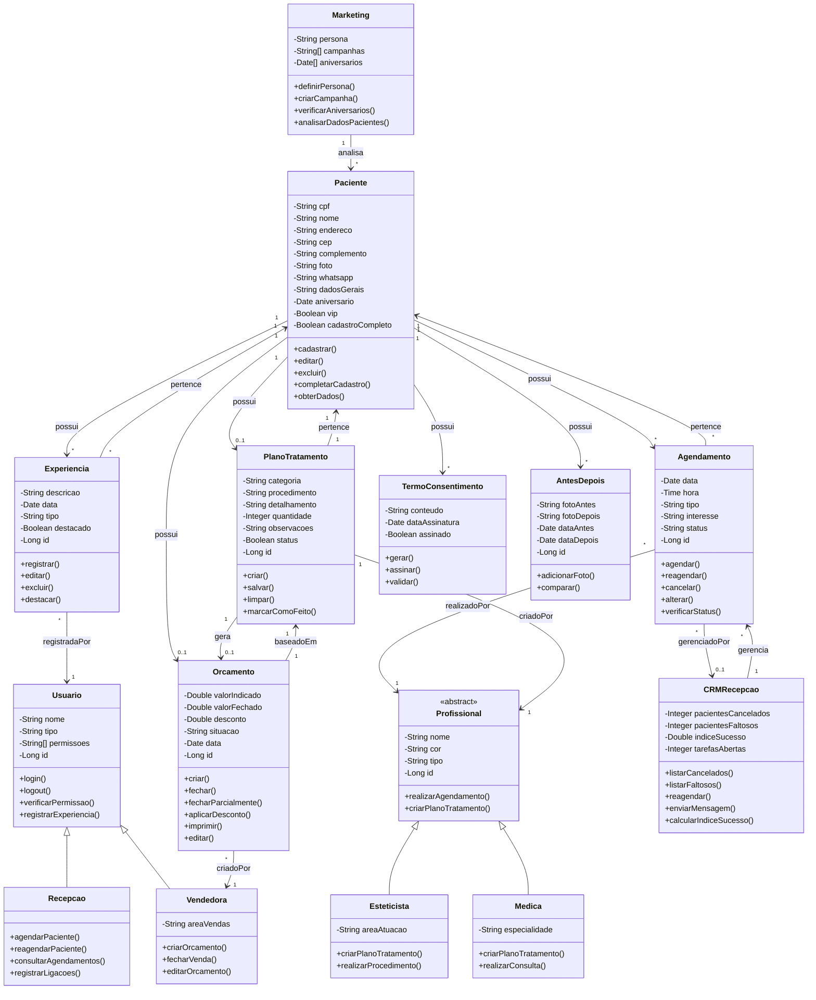

# Diagrama de Classes UML - Sistema GCM

## Descrição das Classes

### Paciente
Representa os pacientes da clínica. Contém informações pessoais, de contato e de cadastro. Pode ter múltiplos agendamentos, experiências registradas, planos de tratamento e orçamentos.

### Agendamento
Representa os agendamentos de consultas, retornos ou procedimentos. Está vinculado a um paciente e a um profissional (médica ou esteticista).

### Profissional (Classe Abstrata)
Classe base para Médica e Esteticista. Define atributos e comportamentos comuns aos profissionais que atendem na clínica.

### Médica
Profissional médico que pode realizar consultas e criar planos de tratamento.

### Esteticista
Profissional esteticista que pode realizar procedimentos e criar planos de tratamento.

### Plano de Tratamento
Plano criado por uma médica ou esteticista para um paciente, contendo procedimentos, categorias e detalhamentos.

### Orçamento
Orçamento baseado em um plano de tratamento, criado por uma vendedora. Pode estar aberto, fechado ou parcialmente fechado.

### Experiência
Registros de experiências do paciente na clínica, que podem ser destacadas para atenção especial.

### Usuário
Classe base para todos os usuários do sistema (recepção, médicas, esteticistas, vendedoras, marketing).

### Vendedora
Usuário especializado em criar e gerenciar orçamentos.

### Recepção
Usuário responsável pelo agendamento e reagendamento de pacientes.

### Marketing
Módulo responsável por análise de dados dos pacientes, definição de personas e campanhas.

### CRM Recepção
Sistema de gestão de relacionamento para acompanhar pacientes que cancelaram ou faltaram, com funcionalidades de reagendamento.

### Termo de Consentimento
Termos de consentimento assinados pelos pacientes.

### Antes e Depois
Fotos comparativas de antes e depois de tratamentos realizados pelos pacientes.

